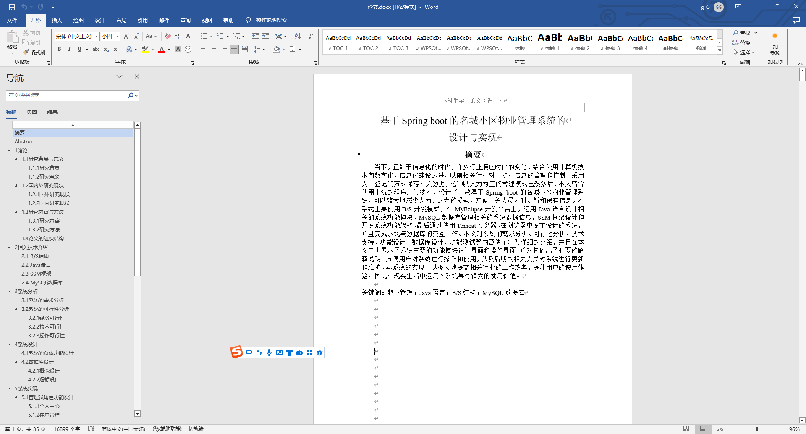
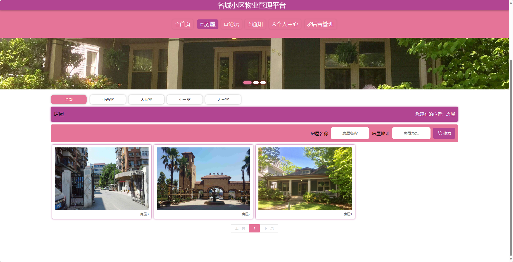
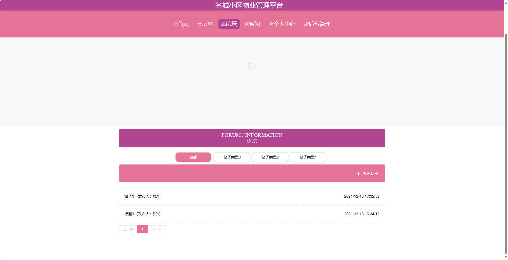
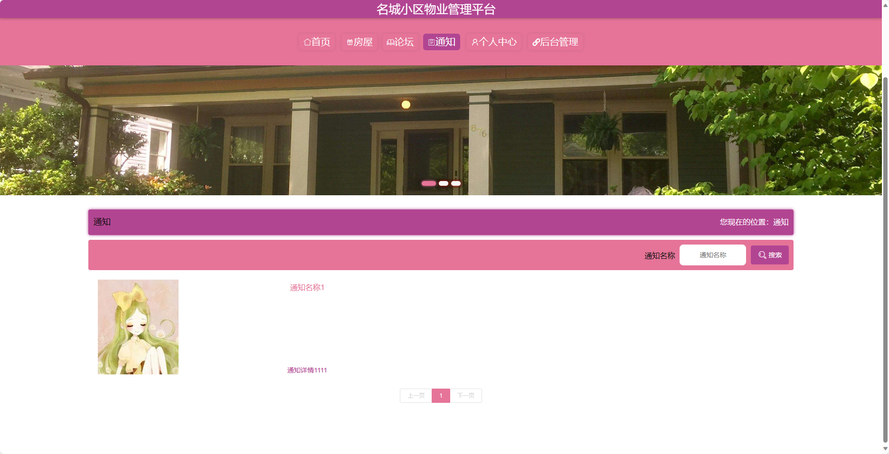
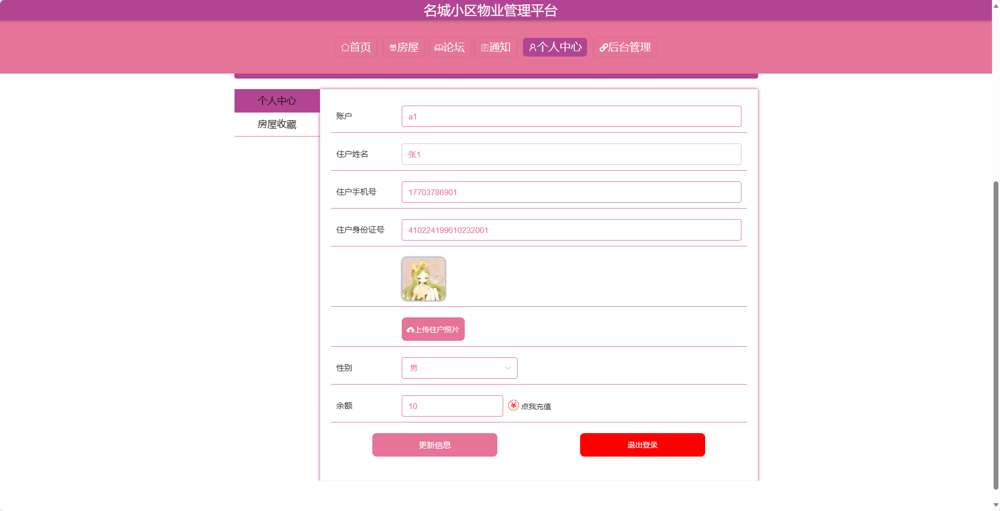
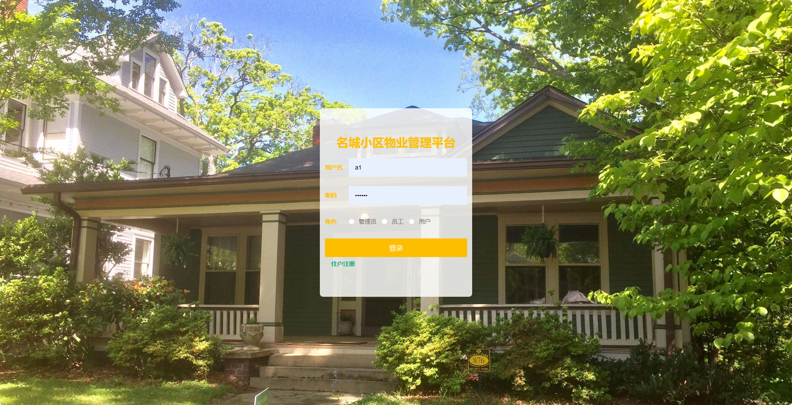
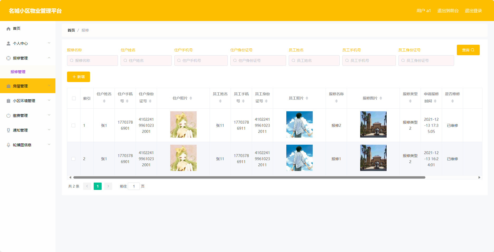
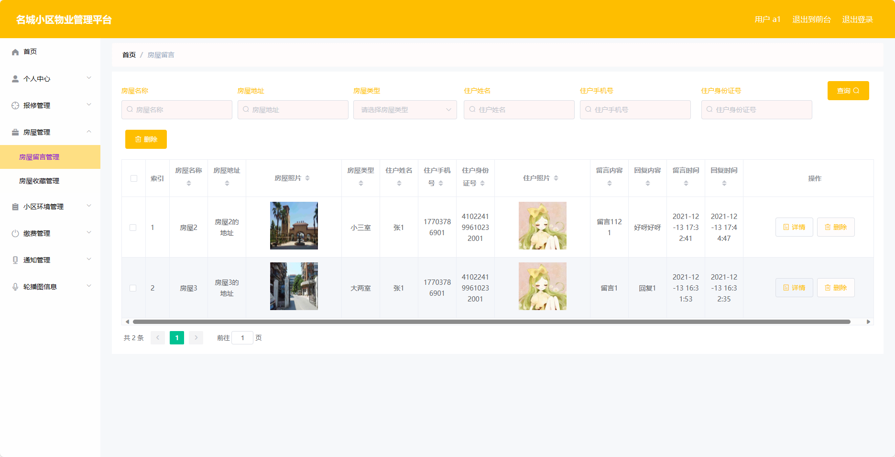
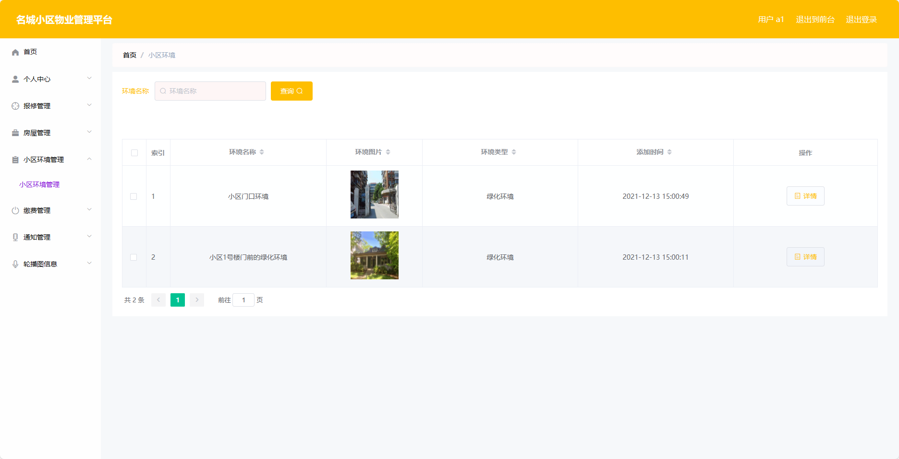
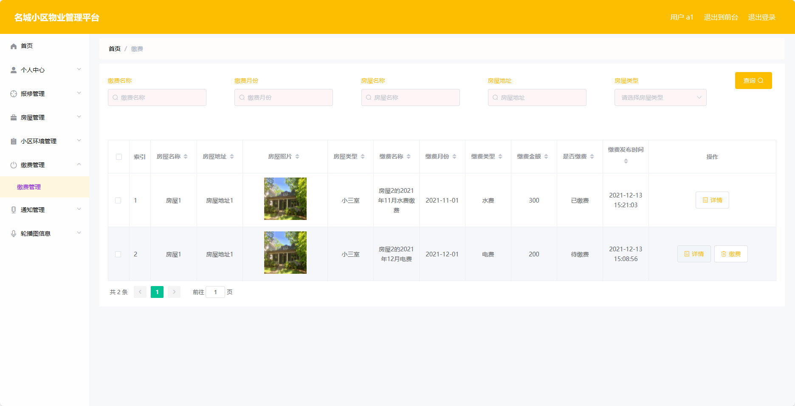

## 基于SpringBoot的名城小区物业管理系统(程序+报告)

###  获取sql数据库文件: 从戎源码网 (https://armycodes.com/) QQ: 386869957 QQ群: 377586148
###  所有系统地址: (https://github.com/YuLin-Coder/AllProjectCatalog) 
###  所有项目以及源代码本人均调试运行无问题 可支持远程安装部署调试、定制修改、代码讲解

## 项目介绍
基于SpringBoot的名城小区物业管理系统，系统包含两种角色：管理员、用户,系统分为前台和后台两大模块，主要功能如下。

### 【管理员】:
- 个人中心：管理员可以管理个人信息，包括修改个人资料。
- 报修管理：管理员可以处理用户提交的报修申请。
- 基础数据管理：管理员可以管理系统的基础数据，包括小区信息、房屋信息等。
- 论坛管理：管理员可以管理论坛信息，包括帖子管理、评论管理等。
- 房屋管理：管理员可以管理房屋信息，包括添加、编辑、删除房屋信息等操作。
- 小区环境管理：管理员可以管理小区环境信息，包括投诉、建议等相关操作。
- 缴费管理：管理员可以管理缴费信息，包括查询、催缴等操作。
- 通知管理：管理员可以管理通知信息，包括发布、编辑、删除通知等操作。
- 住户管理：管理员可以管理住户信息，包括添加、编辑、删除住户等操作。
- 员工管理：管理员可以管理员工信息，包括添加、编辑、删除员工等操作。
- 轮播图信息：管理员可以管理网站首页的轮播图信息，包括添加、编辑、删除轮播图等操作。

### 【用户】:
- 个人中心：用户可以管理个人信息。
- 报修管理：用户可以提交报修申请。
- 房屋管理：用户可以管理自己的房屋信息。
- 小区环境管理：用户可以管理小区环境信息。
- 缴费管理：用户可以查询缴费信息。
- 通知管理：用户可以管理通知信息。
- 轮播图信息：用户可以管理网站首页的轮播图信息，包括添加、编辑、删除轮播图等操作。

### 员工：
- 个人中心：员工可以管理个人信息，包括修改个人资料。
- 报修管理：员工可以处理用户提交的报修申请。
- 房屋管理：员工可以管理房屋信息，包括添加、编辑、删除房屋信息等操作。
- 小区环境管理：员工可以管理小区环境信息，包括投诉、建议等相关操作。
- 缴费管理：员工可以管理缴费信息，包括查询、催缴等操作。
- 通知管理：员工可以管理通知信息，包括发布、编辑、删除通知等操作。
- 轮播图信息：员工可以管理网站首页的轮播图信息，包括添加、编辑、删除轮播图等操作。

### 【前台】:
- 首页：展示小区的基本信息和公告通知等内容。
- 房屋：展示小区房屋信息。
- 论坛：提供小区住户之间的互动平台。
- 通知：展示小区物业管理部门发布的通知消息。
- 个人中心：用户可以管理个人信息。

## 项目技术
- 编程语言：Java
- 数据库：MySQL
- 项目管理工具：Maven
- 前端技术：HTML、CSS、JavaScript、Jquery、Vue
- 后端技术：Spring、SpringMVC、MyBatis

## 运行环境
- JDK版本：JDK1.8及以上
- 开发工具：IDEA、Ecplise、Myecplise都可以
- 数据库: MySQL5.7及以上
- Maven：maven3.0及以上
- Node：14.14.0及以上

## 运行截图

